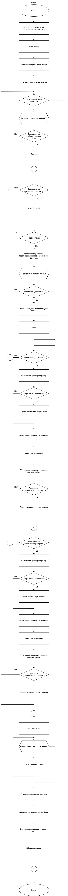
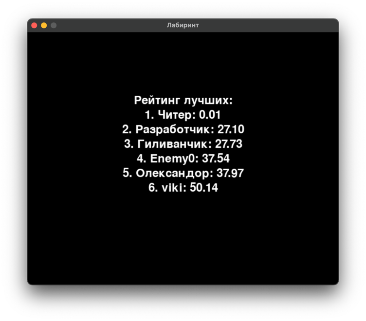

# Практическая работа №26 #

### Тема: Создание рейтинга ###

### Цель: Совершенствование навыков составления программ с библиотекой Pygame ###

#### Задача: ####

> Создайте вывод рейтинга игрока, продумайте стратегию продолжения игры и ее завершение

##### Контрольный пример: #####

> Получаю:
> 1) Кнопка для возможности выхода из игры после игровой сессии;
> 2) Кнопка для повтороного запуска игры;
> 3) Таблица лидеров с десятью лучшими по времени прохождения игроками

##### Системный анализ: #####

> Входные данные: `None`    
> Промежуточные данные: `int screen_width`, `int screen_height`, `tuple black`, `tuple white`, `tuple red`,
`tuple green`, `tuple blue` `int line_width`, `int line_gap`, `int line_offset`, `int door_width`,
`int max_openings_per_line`, `int player_radius`, `int player_speed`, `int player_x`, `int player_y`, `bool is_muted`,
`bool is_paused`, `list lines`, `int num_openings`, `list openings`, `int last_opening_bottom`, `typle leaderboard`,
`str name`, `str time_str`, `float time_result`, `int y_offset`, `int line_height`, `int player_name`,
`int button_width`, `int button_height`, `float start_time`, `bool collided`, `float elapsed_time`     
> Выходные данные: `background_image`, `victory_sound`, `defeat_sound`, `float elapsed_time`, `str name`,
`float time_timeresult`

##### Блок схема: #####


##### Код программы: #####

```python
import os
import pygame
import random
import time

# Инициализация Pygame
pygame.init()
pygame.mixer.init()

# Ширина и высота экрана
screen_width = 640
screen_height = 520
screen = pygame.display.set_mode((screen_width, screen_height))
pygame.display.set_caption('Лабиринт')

# Цвета
black = (0, 0, 0)
white = (255, 255, 255)
red = (255, 0, 0)
green = (0, 255, 0)
blue = (0, 0, 255)

# Параметры стен и дверей
line_width = 10
line_gap = 40
line_offset = 20
door_width = 40
max_openings_per_line = 5

# Параметры игрока и начальная позиция
player_radius = 10
player_speed = 2
player_x = screen_width - 12
player_y = screen_height - 60

# Загрузка и масштабирование фонового изображения
background_image = pygame.image.load('background.jpg')
background_image = pygame.transform.scale(background_image, (screen_width, screen_height - 40))

# Загрузка и настройка музыки
pygame.mixer.music.load('game_music.mp3')  # Фоновая музыка
victory_sound = pygame.mixer.Sound('victory_sound.mp3')  # Звук победы
defeat_sound = pygame.mixer.Sound('defeat_sound.mp3')  # Звук поражения

# Начало воспроизведения фоновой музыки
pygame.mixer.music.play(-1)  # Цикл бесконечно

# Переменные управления звуком и паузой
is_muted = False
is_paused = False


# Функция для отрисовки стен
def draw_walls():
    lines = []
    for i in range(0, screen_width, line_gap):
        num_openings = random.randint(1, max_openings_per_line)
        openings = sorted(
            random.sample(range(line_offset + door_width, screen_height - line_offset - door_width - 40), num_openings))

        last_opening_bottom = 0
        for opening_top in openings:
            # Верхний сегмент стены
            if last_opening_bottom < opening_top:
                lines.append(pygame.Rect(i, last_opening_bottom, line_width, opening_top - last_opening_bottom))
            last_opening_bottom = opening_top + door_width
        # Нижний сегмент стены
        if last_opening_bottom < screen_height - 40:
            lines.append(pygame.Rect(i, last_opening_bottom, line_width, screen_height - last_opening_bottom - 40))
    return lines


# Функция для отображения текста
def show_message(message):
    font = pygame.font.Font(None, 74)
    text = font.render(message, True, white)
    text_rect = text.get_rect(center=(screen_width // 2, screen_height // 2))
    screen.fill(black)
    screen.blit(text, text_rect)
    pygame.display.update()
    pygame.time.delay(5000)


# Функция для обработки паузы и звука
def handle_buttons():
    global is_paused, is_muted
    mouse_pos = pygame.mouse.get_pos()
    # Проверка кнопки паузы
    if pause_button_rect.collidepoint(mouse_pos):
        is_paused = not is_paused  # Переключить состояние паузы
        if is_paused:
            pygame.mixer.music.pause()  # Пауза музыки
        else:
            if not is_muted:  # Если звук не выключен, возобновить музыку
                pygame.mixer.music.unpause()
    # Проверка кнопки звука
    elif mute_button_rect.collidepoint(mouse_pos):
        is_muted = not is_muted  # Переключить состояние звука
        if is_muted:
            pygame.mixer.music.pause()  # Пауза музыки
            victory_sound.stop()  # Остановить звук победы
            defeat_sound.stop()  # Остановить звук поражения
        else:
            pygame.mixer.music.unpause()  # Возобновить музыку


# Функция для чтения и сохранения рейтинга с ником
def update_leaderboard(elapsed_time, player_name):
    leaderboard = []

    # Проверка, существует ли файл с результатами
    if os.path.exists('leaderboard.txt'):
        with open('leaderboard.txt', 'r') as file:
            for line in file:
                try:
                    name, time_str = line.strip().split(': ')
                    leaderboard.append((name, float(time_str)))  # Преобразовать строку в кортеж (имя, время)
                except ValueError:
                    continue  # Игнорировать некорректные данные

    # Добавление нового результата
    leaderboard.append((player_name, elapsed_time))

    # Сортировка результатов по времени (возрастание)
    leaderboard = sorted(leaderboard, key=lambda x: x[1])

    # Ограничение до 10 лучших результатов
    leaderboard = leaderboard[:10]

    # Сохранение в файл
    with open('leaderboard.txt', 'w') as file:
        for name, time_result in leaderboard:
            file.write(f"{name}: {time_result:.2f}\n")


# Функция для отображения лидеров
def show_leaderboard():
    if os.path.exists('leaderboard.txt'):
        with open('leaderboard.txt', 'r') as file:
            leaderboard = file.readlines()
            leaderboard = [time.strip() for time in leaderboard]
    else:
        leaderboard = ["Нет результатов"]

    font = pygame.font.Font(None, 36)
    leaderboard_title = font.render("Рейтинг лучших:", True, white)
    screen.fill(black)

    leaderboard_title_rect = leaderboard_title.get_rect(center=(screen_width // 2, screen_height // 2 - 120))
    screen.blit(leaderboard_title, leaderboard_title_rect)

    # Задаем начальные координаты по Y для отображения результатов
    y_offset = screen_height // 2 - 90  # Начальная позиция по Y
    line_height = 30  # Расстояние между строками

    # Отображаем результаты
    for i in range(min(10, len(leaderboard))):  # Ограничение до 10 результатов
        time_result = leaderboard[i]
        result_text = font.render(f"{i + 1}. {time_result}", True, white)
        result_text_rect = result_text.get_rect(center=(screen_width // 2, y_offset))
        screen.blit(result_text, result_text_rect)
        y_offset += line_height  # Увеличиваем смещение по вертикали для следующей строки

    pygame.display.update()
    pygame.time.delay(5000)  # Задержка на 5 секунд перед возвратом


# Функция для отображения поля ввода ника и кнопки сохранения
def show_name_input(elapsed_time):
    font = pygame.font.Font(None, 36)
    input_box = pygame.Rect(screen_width // 2 - 100, screen_height // 2 - 40, 200, 50)
    save_button_rect = pygame.Rect(screen_width // 2 - 100, screen_height // 2 + 20, 200, 50)
    player_name = ''
    input_active = True

    while input_active:
        for event in pygame.event.get():
            if event.type == pygame.QUIT:
                pygame.quit()
                quit()
            elif event.type == pygame.KEYDOWN:
                if event.key == pygame.K_BACKSPACE:
                    player_name = player_name[:-1]  # Удалить последний символ
                else:
                    player_name += event.unicode  # Добавить символ

            elif event.type == pygame.MOUSEBUTTONDOWN:
                mouse_pos = pygame.mouse.get_pos()
                if save_button_rect.collidepoint(
                        mouse_pos) and player_name.strip():  # Проверка нажатия на кнопку сохранения
                    update_leaderboard(elapsed_time, player_name)
                    input_active = False  # Закрыть цикл ввода и вернуться в игру

        # Очистка экрана
        screen.fill(black)

        # Отрисовка поля для ввода
        pygame.draw.rect(screen, white, input_box, 2)
        name_text = font.render(player_name, True, white)
        screen.blit(name_text, (input_box.x + 10, input_box.y + 10))

        # Отрисовка кнопки сохранения
        pygame.draw.rect(screen, blue, save_button_rect)
        save_text = font.render("Сохранить", True, white)
        save_text_rect = save_text.get_rect(center=save_button_rect.center)
        screen.blit(save_text, save_text_rect)

        pygame.display.update()


def show_time_message(elapsed_time, result_message, game_over=False):
    show_save_button = True

    font = pygame.font.Font(None, 36)
    message = f"Время: {elapsed_time:.2f} секунд"
    text = font.render(message, True, white)
    text_rect = text.get_rect(center=(screen_width // 2, screen_height // 2 - 130))  # Подняли текст

    screen.fill(black)
    screen.blit(text, text_rect)

    # Отображение результата ("Победа!" или "Проигрыш!")
    result_text = font.render(result_message, True, white)
    result_text_rect = result_text.get_rect(center=(screen_width // 2, screen_height // 2 - 170))  # Подняли результат
    screen.blit(result_text, result_text_rect)

    # Размеры кнопок
    button_width = 200
    button_height = 50

    # Создание кнопок (подняли их еще выше)
    retry_button_rect = pygame.Rect((screen_width - button_width) // 2, screen_height // 2 - 60, button_width,
                                    button_height)
    exit_button_rect = pygame.Rect((screen_width - button_width) // 2, screen_height // 2, button_width, button_height)
    leaderboard_button_rect = pygame.Rect((screen_width - button_width) // 2, screen_height // 2 + 60, button_width,
                                          button_height)

    # Поле для ввода имени (подняли вверх)
    input_box = pygame.Rect((screen_width - button_width) // 2, screen_height // 2 + 120, button_width, button_height)
    save_button_rect = pygame.Rect((screen_width - button_width) // 2, screen_height // 2 + 180, button_width,
                                   button_height)
    player_name = ''

    # Флаг активности поля ввода
    input_active = True

    while input_active:
        for event in pygame.event.get():
            if event.type == pygame.QUIT:
                pygame.quit()
                quit()
            elif event.type == pygame.KEYDOWN:
                if event.key == pygame.K_BACKSPACE:
                    player_name = player_name[:-1]  # Удалить последний символ
                else:
                    player_name += event.unicode  # Добавить символ

            elif event.type == pygame.MOUSEBUTTONDOWN:
                mouse_pos = pygame.mouse.get_pos()
                if retry_button_rect.collidepoint(mouse_pos):
                    return True  # Повторить игру
                elif exit_button_rect.collidepoint(mouse_pos):
                    pygame.quit()
                    quit()  # Выйти из игры
                elif leaderboard_button_rect.collidepoint(mouse_pos):  # Проверка нажатия на кнопку "Лидеры"
                    show_leaderboard()  # Показать таблицу лидеров
                    pygame.time.delay(5000)  # Задержка для показа таблицы лидеров
                elif show_save_button and save_button_rect.collidepoint(mouse_pos) and player_name.strip():
                    update_leaderboard(elapsed_time, player_name)
                    show_save_button = False  # Удалить кнопку сохранения

        # Очистка экрана и перерисовка кнопок
        screen.fill(black)
        screen.blit(result_text, result_text_rect)
        screen.blit(text, text_rect)

        pygame.draw.rect(screen, blue, retry_button_rect)
        pygame.draw.rect(screen, blue, exit_button_rect)
        pygame.draw.rect(screen, blue, leaderboard_button_rect)  # Отрисовка кнопки "Лидеры"

        retry_text = font.render("Еще раз", True, white)
        exit_text = font.render("Выйти", True, white)
        leaderboard_text = font.render("Лидеры", True, white)  # Текст кнопки "Лидеры"

        retry_text_rect = retry_text.get_rect(center=retry_button_rect.center)
        exit_text_rect = exit_text.get_rect(center=exit_button_rect.center)
        leaderboard_text_rect = leaderboard_text.get_rect(center=leaderboard_button_rect.center)

        screen.blit(retry_text, retry_text_rect)
        screen.blit(exit_text, exit_text_rect)
        screen.blit(leaderboard_text, leaderboard_text_rect)  # Отображение текста кнопки "Лидеры"

        if game_over:
            # Отрисовка поля для ввода (поднято вверх)
            pygame.draw.rect(screen, white, input_box, 2)
            name_text = font.render(player_name, True, white)
            screen.blit(name_text, (input_box.x + 10, input_box.y + 10))

            # Отрисовка кнопки сохранения, если это необходимо
            if show_save_button:
                pygame.draw.rect(screen, blue, save_button_rect)
                save_text = font.render("Сохранить", True, white)
                save_text_rect = save_text.get_rect(center=save_button_rect.center)
                screen.blit(save_text, save_text_rect)

        pygame.display.update()


# Обновление в основной функции при победе
def main():
    global player_x, player_y, start_time
    lines = draw_walls()  # Отрисовка стен
    clock = pygame.time.Clock()

    # Переменные таймера
    start_time = time.time()

    # Кнопки паузы и звука
    global pause_button_rect, mute_button_rect
    pause_button_rect = pygame.Rect(screen_width - 210, screen_height - 35, 80, 30)
    mute_button_rect = pygame.Rect(screen_width - 120, screen_height - 35, 80, 30)

    while True:
        for event in pygame.event.get():
            if event.type == pygame.QUIT:
                pygame.quit()
                quit()
            if event.type == pygame.MOUSEBUTTONDOWN:
                handle_buttons()  # Обработка нажатий кнопок

        if is_paused:
            continue  # Пропустить остальную логику, если игра на паузе

        # Движение игрока
        keys = pygame.key.get_pressed()
        if keys[pygame.K_LEFT] and player_x > player_radius:
            player_x -= player_speed
        elif keys[pygame.K_RIGHT] and player_x < screen_width - player_radius:
            player_x += player_speed
        elif keys[pygame.K_UP] and player_y > player_radius:
            player_y -= player_speed
        elif keys[pygame.K_DOWN] and player_y < screen_height - player_radius - 40:  # Учитывать пространство для кнопок
            player_y += player_speed

        # Проверка столкновений игрока со стенами
        player_rect = pygame.Rect(player_x - player_radius, player_y - player_radius, player_radius * 2,
                                  player_radius * 2)
        collided = False

        for line in lines:
            if line.colliderect(player_rect):
                collided = True
                break

        # Проверка столкновения с нижней стеной (поражение)
        if collided:
            pygame.mixer.music.pause()  # Остановить текущую музыку
            if not is_muted:  # Проверить, что звук не выключен
                defeat_sound.play()  # Проиграть звук поражения
            elapsed_time = time.time() - start_time  # Вычислить время
            show_time_message(elapsed_time, "Проигрыш!", game_over=False)  # Показать сообщение о времени
            # Сброс начальных параметров для новой игры
            player_x = screen_width - 12
            player_y = screen_height - 60
            start_time = time.time()  # Сбросить таймер

            if not is_muted:  # Проверить состояние звука при перезапуске
                pygame.mixer.music.play(-1)  # Перезапустить музыку

            continue

        # Проверка столкновения с левой стеной (победа)
        if player_rect.colliderect(pygame.Rect(0, 0, line_width, screen_height)):
            pygame.mixer.music.stop()  # Остановить текущую музыку
            if not is_muted:  # Проверить, что звук не выключен
                victory_sound.play()  # Проиграть звук победы
            elapsed_time = time.time() - start_time  # Вычислить время
            show_time_message(elapsed_time, "Победа!", game_over=True)  # Показать сообщение о времени и поле для ввода
            pygame.time.delay(5000)  # Дать время игроку увидеть рейтинг
            # Сброс начальных параметров для новой игры
            player_x = screen_width - 12
            player_y = screen_height - 60
            start_time = time.time()  # Сбросить таймер

            if not is_muted:  # Проверить состояние звука при перезапуске
                pygame.mixer.music.play(-1)  # Перезапустить музыку

            continue

        # Очистка экрана
        screen.blit(background_image, (0, 0))

        # Отрисовка стен
        for line in lines:
            pygame.draw.rect(screen, red, line)

        # Отрисовка игрока
        pygame.draw.circle(screen, green, (player_x, player_y), player_radius)

        # Очистка области таймера
        timer_rect = pygame.Rect(0, screen_height - 30, screen_width, 30)
        pygame.draw.rect(screen, black, timer_rect)  # Очистить область таймера фоновым цветом

        # Отрисовка таймера в левом нижнем углу
        elapsed_time = time.time() - start_time
        timer_font = pygame.font.Font(None, 36)
        timer_text = timer_font.render(f"Время: {elapsed_time:.2f} сек", True, white)
        screen.blit(timer_text, (10, screen_height - 30))  # Позиция текста таймера

        # Отрисовка кнопок паузы и звука
        pygame.draw.rect(screen, blue, pause_button_rect)
        pygame.draw.rect(screen, blue, mute_button_rect)

        # В начале функции main()
        font = pygame.font.Font(None, 36)  # Создаем шрифт

        pause_text = font.render("Пауза", True, white)
        mute_text = font.render("Звук", True, white)
        pause_text_rect = pause_text.get_rect(center=pause_button_rect.center)
        mute_text_rect = mute_text.get_rect(center=mute_button_rect.center)
        screen.blit(pause_text, pause_text_rect)
        screen.blit(mute_text, mute_text_rect)

        pygame.display.update()
        clock.tick(60)


# Запуск основной функции
if __name__ == "__main__":
    main()
```

##### Результат работы программы: #####

> 1,2. Кнопки перезапуска и завершения игры:     
>     
> 3) Поле для ввода ника:    
>    
>Таблица лидеров:  
 .  

##### Контрольные вопросы: #####

1. Модули для работы программы:  
   `pygame`: Библиотека для создания игр, обеспечивающая работу с графикой, звуком и событиями.  
   `random`: Модуль для генерации случайных чисел, используемый для случайного размещения стен в лабиринте.  
   `time`: Модуль для работы с временем, используемый для отслеживания времени игры и вычисления прошедшего времени.


2. Функции для работы программы:  
   `main()`: Основная функция программы, управляющая логикой игры, обработкой событий, движением игрока и отрисовкой
   элементов на экране.  
   `draw_walls()`: Функция для отрисовки стен лабиринта, генерирующая случайные отверстия в стенах и возвращающая их
   позиции в виде списка прямоугольников.  
   `show_message(message)`: Функция для отображения текстовых сообщений (например, "Победа!" или "Проигрыш!") на
   экране.  
   `show_time_message(elapsed_time, result_message)`: Функция для отображения сообщения с прошедшим временем и
   результатом игры.  
   `handle_buttons()`: Функция для обработки нажатий на кнопки паузы и звука.  
   `update_leaderboard(elapsed_time, player_name)`: Обновляет таблицу лидеров с учетом нового результата игрока.
   `show_leaderboard()`: Отображает на экране таблицу лидеров.  
   `show_name_input(elapsed_time)`: Позволяет игроку ввести свое имя после окончания игры и сохранения его результата.

##### Вывод по проделанной работе: #####

> В ходе данной практики я добавил в свою игру возможность завершения и продолжения игровой сессии, а также добавил
> рейтинг.